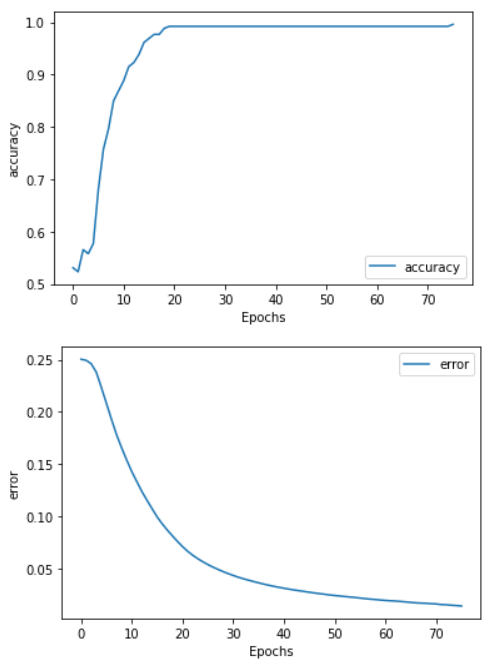
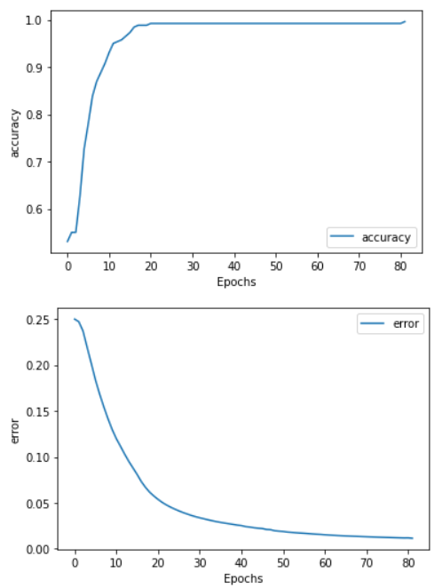

# ANN-with-Momentum
Artificial Neural Networks with Back Propagation and Momentum (Without using keras and tensorflow)

## Models
1. [Emergency Vehicle Classification - Ambulance](ANN_with_Momentum_Emergency_Vehicle_Classification.ipynb)
1. [Classify image as cat or not cat](ANN_with_Momentum.ipynb)

## Implementation Steps
1. Import necessary libraries
    - numpy
    - matplotlib
    - glob
    - cv2
    - random
    - os

1. Download and preprocess the dataset
    - Load Training and Test Datasets
    - Shuffle Training and Test Datasets
    - Resize and Normalize the images

1.  Initialize random weights and biases
    - Create dictionary to store weights and biases
    - Initialize weights and biases to zero for backpropagation

1. Fix all hyperparameters
    - Learning rate
    - Number of epochs
    - Number of layers
    - Number of units in each layer
    - Momentum (𝛂)

1. Until the termination condition is met, Do
    - For each training example, Do
      - **Forward Propagation:** Calculate the output of each unit and propagate through the layers.
      - **Backward Propagation:**	Calculate the errors (for output and hidden units). Calculate the change in weights & biases. Add the momentum and update the weights & biases.

---

## Emergency Vehicle Classification - Ambulance

### Accuracy and Error - ANN without Momentum

### Accuracy and Error - ANN with Momentum

### Classification made by the model

---

## References
- [Building your Neural Network Step by Step](https://github.com/amanchadha/coursera-deep-learning-specialization/tree/master/C1%20-%20Neural%20Networks%20and%20Deep%20Learning/Week%204/Building%20your%20Deep%20Neural%20Network%20-%20Step%20by%20Step)
- Machine Learning - Tom Mitchell

### Note
This is a project done for Machine Learning Course (Team of 4)